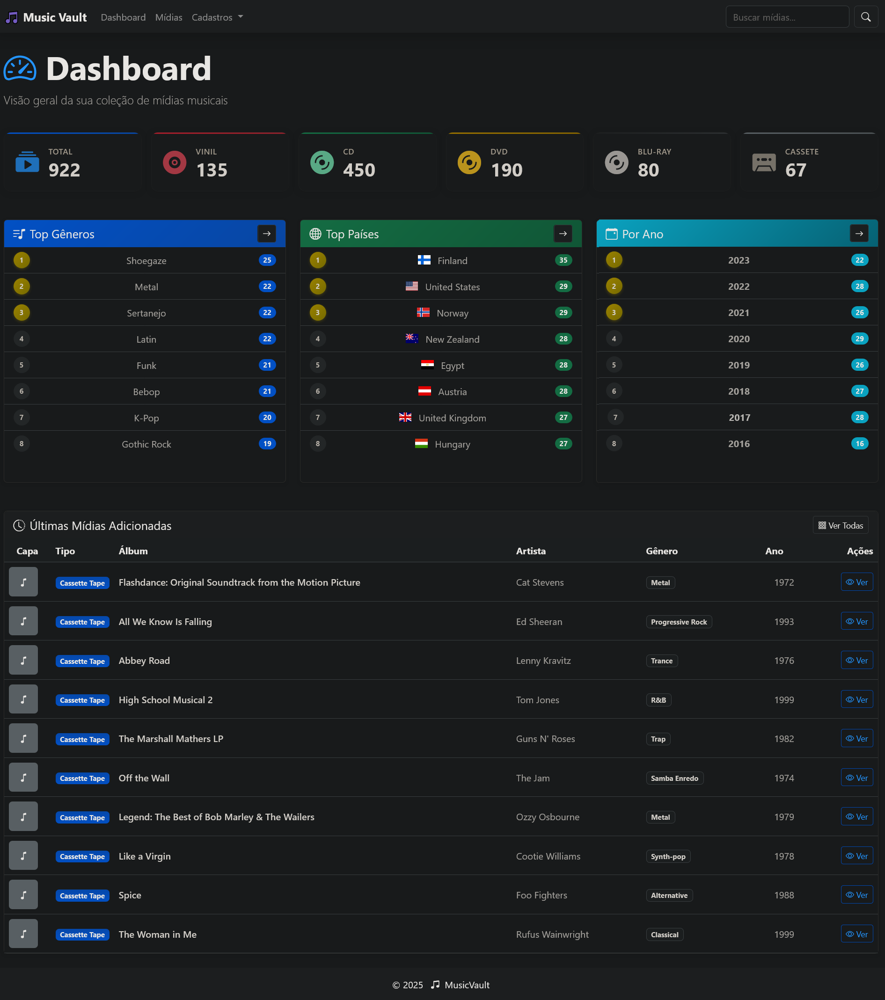
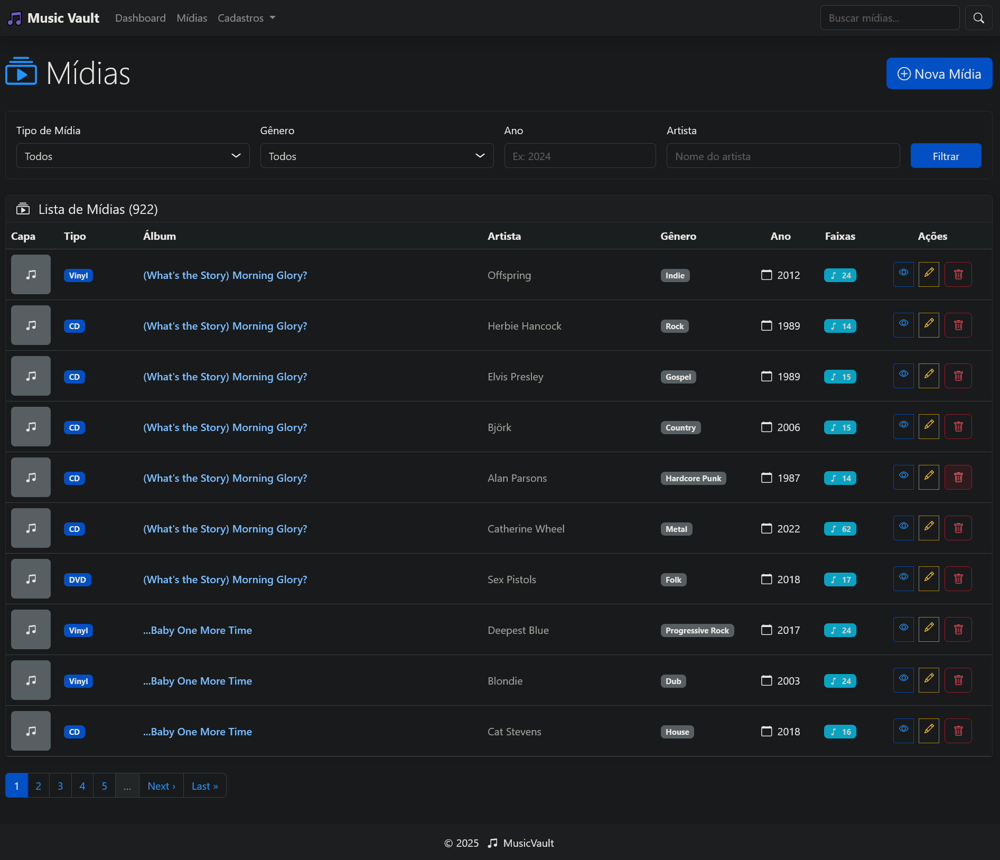
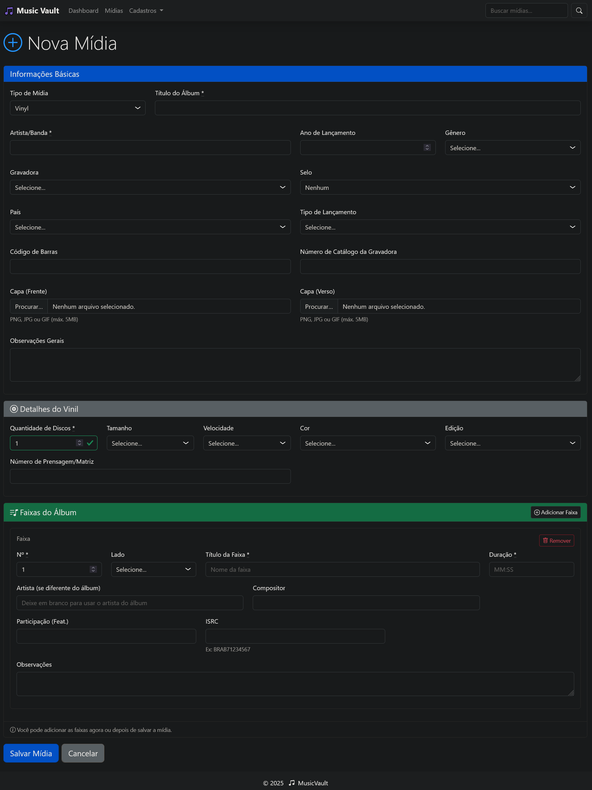

# 🎵 Catálogo de Mídias Musicais (MUSIC VAULT)

[](https://www.ruby-lang.org/)
[](https://rubyonrails.org/)
[](https://getbootstrap.com/)
[](LICENSE)

Sistema completo para catalogação e gerenciamento de coleções de mídias musicais físicas (Discos de Vinil, CDs, DVDs, Blu-Ray e Fitas Cassete).


## 📋 Índice

- [Sobre o Projeto](#sobre-o-projeto)
- [Funcionalidades](#funcionalidades)
- [Tecnologias](#tecnologias)
- [Pré-requisitos](#pré-requisitos)
- [Instalação](#instalação)
- [Uso](#uso)
- [Estrutura do Banco de Dados](#estrutura-do-banco-de-dados)
- [Screenshots](#screenshots)
- [Roadmap](#roadmap)
- [Contribuindo](#contribuindo)
- [Licença](#licença)
- [Contato](#contato)

## 🎯 Sobre o Projeto

O **Catálogo de Mídias Musicais** é uma aplicação web desenvolvida em Ruby on Rails para colecionadores de mídias físicas que desejam organizar, catalogar e gerenciar suas coleções de forma profissional e eficiente.

### Características Principais

- ✅ Suporte completo para 5 tipos de mídia (Vinil, CD, DVD, Blu-Ray e Cassete)
- ✅ Detalhes específicos para cada tipo de mídia
- ✅ Gerenciamento completo de faixas musicais
- ✅ Sistema de filtros e busca avançada
- ✅ Dashboard com estatísticas da coleção
- ✅ Interface moderna e responsiva
- ✅ Validações robustas de dados

## ✨ Funcionalidades

### Catálogo de Mídias

- **CRUD Completo**: Criar, visualizar, editar e excluir mídias
- **Tipos Suportados**:
  - 🎵 **Disco de Vinil**: Tamanho (12", 10", 7"), velocidade (33/45 RPM), cor, edição, número de prensagem
  - 💿 **CD**: Quantidade de discos
  - 📀 **DVD**: Quantidade de DVDs
  - 📀 **BLURAY**: Quantidade de Blu-Rays
  - 📼 **Fita Cassete**: Tipo (Normal, CrO2, Metal), duração (C60, C90, C120)
- **Informações Gerais**: Título, artista, gravadora, selo, gênero, país, ano, tipo de lançamento
- **Capas**: Arquivar imagens da capa (frente e verso)
- **Códigos**: Código de barras e código da gravadora

### Gerenciamento de Faixas

- Adicionar múltiplas faixas por mídia
- Suporte a discos/DVDs/CDs/Blu-Rays múltiplos
- Suporte a lados (A/B/C/D) para vinil e (A/B) para cassete
- Informações detalhadas: título, artista/intérprete, compositor, participações especiais
- Duração das faixas (formato HH:MM:SS)
- Código ISRC (International Standard Recording Code)
- Cálculo automático da duração total do álbum

### Tabelas de Suporte

- 🎸 Gêneros musicais
- 🏢 Gravadoras
- 🏷️ Selos
- 🌍 Países
- 📻 Tipos de lançamento
- 💽 Tipos de mídia
- 📼 Tipos e durações de cassete

### Busca e Filtros

- Busca por título ou artista
- Filtrar por tipo de mídia
- Filtrar por gênero
- Filtrar por ano de lançamento
- Filtrar por artista

### Dashboard e Estatísticas

- Total de mídias por tipo
- Top 10 gêneros mais populares
- Top 10 paises mais populares
- Top 10 anos mais populares
- Cards visuais com estatísticas
- Últimas mídias adicionadas

## 🛠 Tecnologias

### Backend

- **Ruby** 3.4
- **Ruby on Rails** 7.0
- **PostgreSQL** (banco de dados)

### Frontend

- **Bootstrap** 5.3.3 (via esbuild)
- **Bootstrap Icons** 1.11.3
- **Stimulus JS** (controllers JavaScript)
- **Turbo** (Hotwire)
- **esbuild** (bundler)

### Gems Principais

- **simple_form** - Formulários simplificados
- **kaminari** - Paginação
- **dotenv-rails** - Segurança
- **Faker** - Dados faker
- **bootstrap5-kaminari-views** - Paginação style

## 📦 Pré-requisitos

Antes de começar, certifique-se de ter instalado:

- Ruby 3.4+
- Rails 7.0+
- PostgreSQL 12+
- Node.js 16+ e Yarn ou npm
- Git

## 🚀 Instalação

### 1. Clone o repositório

```bash
git clone https://github.com/VulcanoBr/MusicVault.git
cd musicvault
```

### 2. Instale as dependências Ruby

```bash
bundle install
```

### 3. Instale as dependências JavaScript

```bash
yarn install

```

### 4. Configure o banco de dados

Edite o arquivo `config/database.yml` com suas credenciais PostgreSQL, depois execute:

```bash
rails db:create
rails db:migrate
```

### 4.1 Popular o banco com dados iniciais

    4.1.1 Popula as tabelas de suporte (media_types, genres, etc.)

```bash
 rails dev_catalog:seed
```

    4.1.2. Popula as tabelas principais (media_physicals, tracks, etc.)

```bash
 rails dev_catalog:seed_main_data
```

### 5. Inicie o servidor

```bash
./bin/dev
```

Acesse a aplicação em: `http://localhost:3000`

## 💻 Uso

### Primeira Utilização

1. Acesse o dashboard em `http://localhost:3000`
2. Comece cadastrando as tabelas de suporte (Gêneros, Gravadoras, etc.) se necessário
3. Adicione sua primeira mídia clicando em "Nova Mídia"
4. Selecione o tipo de mídia e preencha as informações
5. Adicione as faixas do álbum

### Adicionando uma Mídia

1. Clique em "Mídias" no menu
2. Clique no botão "Nova Mídia"
3. Selecione o tipo de mídia (Vinil, CD, DVD, Blu-Ray ou Cassete)
4. Preencha as informações básicas:
   - Título do álbum
   - Artista/Banda
   - Gravadora, selo, gênero, país
   - Ano de lançamento
   - Tipo de lançamento
   - Capa (frente e verso) da mídia
5. Preencha os detalhes específicos da mídia (aparecem automaticamente)
6. Clique em "Salvar Mídia"

### Adicionando Faixas

1. Acesse a página de detalhes da mídia
2. Clique em "Adicionar Faixa"
3. Preencha:
   - Número da faixa
   - Disco (se múltiplos discos)
   - Lado (se vinil ou cassete)
   - Título da faixa
   - Artista (opcional, usa o artista do álbum se vazio)
   - Compositor
   - Participações especiais (Feat.)
   - Duração
   - Código ISRC (opcional)
4. Clique em "Salvar Faixa"

### Busca e Filtros

Na página de listagem de mídias:

- Use a barra de busca no topo para buscar por título ou artista
- Use os filtros para refinar por tipo, gênero, ano ou artista
- Clique em "Filtrar" para aplicar

## 🗄 Estrutura do Banco de Dados

### Diagrama ER

```
┌─────────────┐       ┌──────────────┐       ┌─────────────┐
│    Media    │◄───── ┤ VinylDetail  │       │  MediaType  │
│             │       │              │       │             │
│ - id        │       │ - id         │       │ - id        │
│ - title     │       │ - medium_id  │       │ - description│
│ - artist    │       │ - disc_qty   │       └─────────────┘
│ - year      │       │ - size       │
│ - ...       │       │ - speed      │       ┌─────────────┐
└─────────────┘       │ - color      │       │   Genre     │
      │               │ - edition    │       │             │
      │               └──────────────┘       │ - id        │
      │                                      │ - description│
      │               ┌──────────────┐       └─────────────┘
      │◄───────────── ┤  CDDetail    │
      │               │              │       ┌─────────────┐
      │               │ - id         │       │   Label     │
      │               │ - medium_id  │       │             │
      │               │ - disc_qty   │       │ - id        │
      │               └──────────────┘       │ - description│
      │                                      └─────────────┘
      │               ┌──────────────┐
      │◄───────────── ┤  DVDDetail   │       ... (outras tabelas)
      │               └──────────────┘
      │
      │               ┌──────────────┐
      │◄───────────── |CassetteDetail│
      │               └──────────────┘
      │
            │        ┌──────────────┐
      │◄─────────────|BluRaiDetail  │
      │              └──────────────┘
      │
      ▼
┌─────────────┐
│   Track     │
│             │
│ - id        │
│ - medium_id │
│ - number    │
│ - disc_num  │
│ - side      │
│ - title     │
│ - artist    │
│ - composer  │
│ - duration  │
│ - isrc      │
└─────────────┘
```

### Principais Tabelas

- **media**: Tabela principal com informações gerais das mídias
- **vinyl_details, cd_details, dvd_details, blu_ray_details, cassette_details**: Detalhes específicos por tipo
- **tracks**: Faixas musicais
- **media_types, genres, labels, imprints, countries, release_types**: Tabelas de suporte

## 📸 Screenshots

### Dashboard



### Lista de Mídias



### Detalhes da Mídia


### Formulário de Cadastro



## 🤝 Contribuindo

Contribuições são bem-vindas! Siga os passos:

1. Faça um Fork do projeto
2. Crie uma branch para sua feature (`git checkout -b feature/AmazingFeature`)
3. Commit suas mudanças (`git commit -m 'Add some AmazingFeature'`)
4. Push para a branch (`git push origin feature/AmazingFeature`)
5. Abra um Pull Request

### Padrões de Código

- Siga as convenções do Ruby Style Guide
- Escreva testes para novas funcionalidades
- Mantenha o código documentado
- Use commits semânticos

## 📝 Licença

Distribuído sob a licença MIT. Veja `LICENSE` para mais informações.

## 📧 Contato

Seu Nome - [@seu_twitter](https://twitter.com/seu_twitter) - email@exemplo.com

Link do Projeto: [https://github.com/VulcanoBr/MusicVault](https://github.com/VulcanoBr/MusicVault)

---

## 🙏 Agradecimentos

- [Ruby on Rails](https://rubyonrails.org/)
- [Bootstrap](https://getbootstrap.com/)
- [Bootstrap Icons](https://icons.getbootstrap.com/)
- [Simple Form](https://github.com/heartcombo/simple_form)
- [Kaminari](https://github.com/kaminari/kaminari)

---

**Desenvolvido com ❤️ e muita música 🎵**
